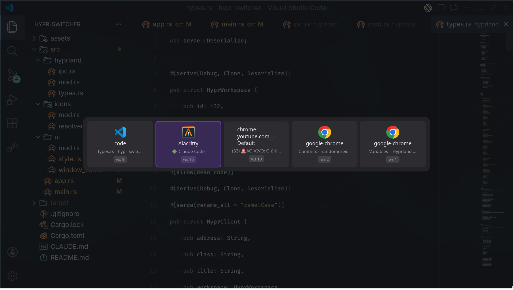

# hypr-switcher

A visual Alt+Tab window switcher for [Hyprland](https://hyprland.org/), written in Rust. It renders a fullscreen Wayland layer-shell overlay showing all open windows across all workspaces, with keyboard navigation to quickly select and focus any window.



## Features

- Visual overlay showing all open windows with icons, titles, and workspace badges
- Keyboard navigation: Tab/Arrow keys to cycle, Enter to confirm, Escape to dismiss
- Standard Alt+Tab behavior: releasing Alt confirms the selection
- Reverse cycling with Shift+Tab or `--reverse` flag
- Automatic icon resolution from XDG `.desktop` files with theme support
- Exec-on-keybind design: zero resource usage when inactive
- IPC-based fast cycling: subsequent Alt+Tab presses cycle the existing overlay instead of restarting
- PID file deduplication to prevent stacking overlays
- Horizontal scrollable card layout with accent-highlighted selection
- Automatic focus when only one window is open

## Requirements

- [Hyprland](https://hyprland.org/) (Wayland compositor)
- Rust toolchain (1.85+ for edition 2024)
- System dependencies for Wayland/layer-shell rendering

### System Dependencies (Arch Linux)

```bash
sudo pacman -S wayland wayland-protocols libxkbcommon
```

### System Dependencies (Fedora)

```bash
sudo dnf install wayland-devel wayland-protocols-devel libxkbcommon-devel
```

### System Dependencies (Ubuntu/Debian)

```bash
sudo apt install libwayland-dev wayland-protocols libxkbcommon-dev
```

## Installation

### From Source

```bash
git clone https://github.com/nandomoreirame/hypr-switcher.git
cd hypr-switcher
cargo build --release
```

The binary will be at `target/release/hypr-switcher`.

### Install to PATH

```bash
cp target/release/hypr-switcher ~/.local/bin/
```

Make sure `~/.local/bin` is in your `$PATH`.

## Hyprland Configuration

Add the following to your Hyprland config (e.g. `~/.config/hypr/bindings.conf` or `~/.config/hypr/hyprland.conf`):

```ini
# Unbind default Alt+Tab if previously set
unbind = ALT, TAB
unbind = ALT SHIFT, TAB

# Bind hypr-switcher
bindd = ALT, TAB, Window switcher, exec, hypr-switcher
bindd = ALT SHIFT, TAB, Window switcher (reverse), exec, hypr-switcher --reverse
```

After editing, reload Hyprland:

```bash
hyprctl reload
```

## Usage

Once configured, press **Alt+Tab** to open the switcher overlay. The overlay shows all open windows as horizontal cards with:

- Application icon (resolved from your icon theme)
- Application class name
- Window title (truncated if long)
- Workspace badge

### Keyboard Controls

| Key | Action |
|-----|--------|
| `Tab` / `Arrow Right` | Select next window |
| `Shift+Tab` / `Arrow Left` | Select previous window |
| `Enter` | Focus selected window and close overlay |
| `Escape` | Dismiss overlay without changing focus |
| Release `Alt` | Focus selected window and close overlay |

### Behavior

- **First press**: The overlay opens with the previously focused window pre-selected (index 1), matching standard Alt+Tab behavior.
- **Subsequent presses**: If the overlay is already open, additional Alt+Tab presses cycle through windows via IPC without restarting the overlay.
- **Single window**: If only one window is open, it is auto-focused immediately without showing the overlay.
- **No windows**: The overlay shows an empty state message and dismisses on any key press.

### CLI Options

```
hypr-switcher              # Open switcher, cycle forward
hypr-switcher --reverse    # Open switcher, cycle backward
```

## Architecture

```
src/
├── main.rs              # Entry point: PID management, IPC listener, iced launch
├── app.rs               # Iced application state, update loop, keyboard handling
├── hyprland/
│   ├── mod.rs
│   ├── ipc.rs           # Hyprland Unix socket IPC (get_clients, focus_window)
│   └── types.rs         # HyprClient, WindowEntry structs with serde
├── icons/
│   ├── mod.rs
│   └── resolver.rs      # XDG icon resolution with theme + pixmaps fallback
└── ui/
    ├── mod.rs
    ├── style.rs          # Design tokens (colors, dimensions)
    └── window_list.rs    # Window card rendering (icon + class + title + badge)
```

### Tech Stack

| Component | Choice |
|-----------|--------|
| Language | Rust (edition 2024) |
| UI Framework | [iced](https://github.com/iced-rs/iced) 0.14 + [iced_layershell](https://github.com/waycrate/exwlshelleern) 0.15 |
| Async Runtime | tokio (for Unix socket IPC) |
| Serialization | serde + serde_json |
| Icons | freedesktop-icons + XDG .desktop file parsing |
| Logging | tracing + tracing-subscriber |

## Development

### Build

```bash
cargo build
```

### Run Tests

```bash
cargo test
```

### Run with Debug Logging

```bash
RUST_LOG=debug cargo run
```

### Run a Specific Test Module

```bash
cargo test hyprland::
cargo test icons::
cargo test app::
```

## Icon Theme

By default, hypr-switcher uses the `Yaru-purple` icon theme. To change it, modify the theme name in `src/main.rs`:

```rust
let mut icon_resolver = IconResolver::new(Some("Your-Theme-Name".to_string()));
```

The icon resolution follows this fallback chain:

1. XDG icon theme lookup (configured theme)
2. Hicolor fallback (default freedesktop theme)
3. `/usr/share/pixmaps/` directory
4. No icon (card displays without icon)

## License

MIT
